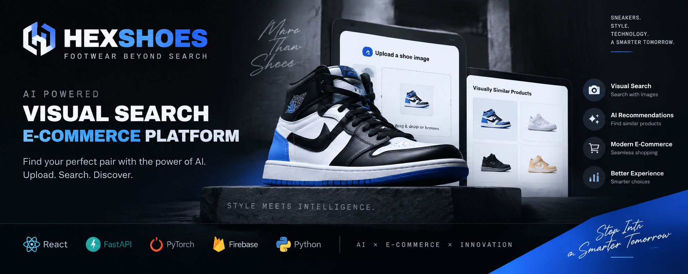
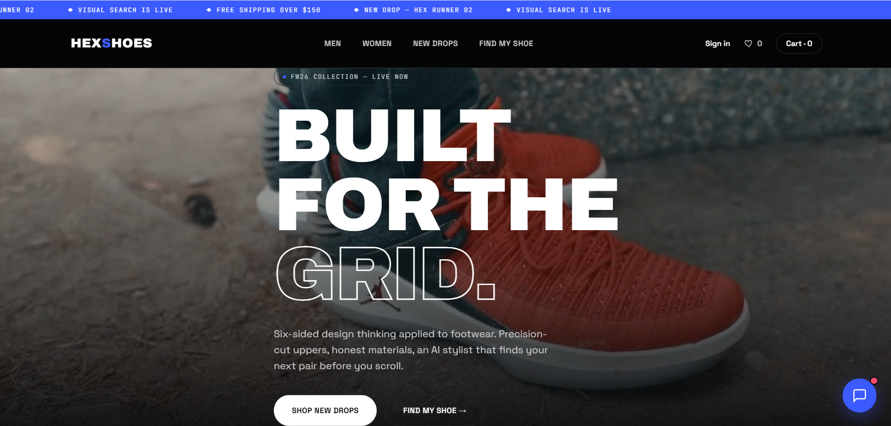
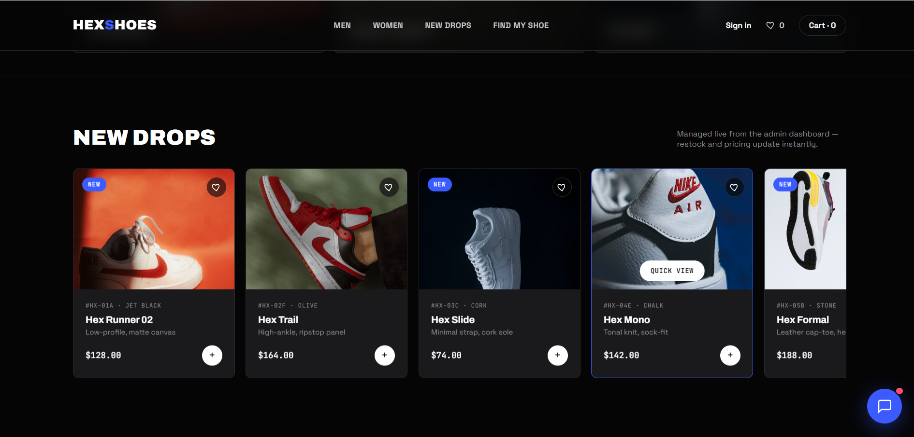

<p align="center">
  
</p>

<br>

<h1 align="center">👟 HEXSHOES - AI Visual Search E-Commerce Platform</h1>

<p align="center">
  An AI-powered footwear e-commerce platform that uses Computer Vision and Deep Learning to provide intelligent visual search and personalized product recommendations.
</p>

<p align="center">


</p>

---

# 📌 Project Overview

HEXSHOES is an AI-powered e-commerce platform designed to transform the traditional footwear shopping experience using Artificial Intelligence, Computer Vision, and Deep Learning technologies.

Unlike traditional e-commerce platforms that rely only on text-based searching, HEXSHOES allows users to upload footwear images and discover visually similar products using AI-powered image understanding.

The project combines:

- Artificial Intelligence
- Computer Vision
- Deep Learning
- Full-Stack Development
- E-Commerce Technologies

to create a smarter footwear discovery experience.

---

# 🎯 Problem Statement

Finding products online can be difficult when users:

- Do not know the exact product name
- Want to find visually similar footwear
- Need personalized recommendations

Traditional keyword-based search systems cannot fully understand visual appearance.

HEXSHOES addresses this challenge by introducing an AI-based visual search system that understands footwear images and recommends similar products.

---

# 🚀 Key Features

## 🔍 AI Visual Search

Users can upload a footwear image and find similar products using computer vision technology.

Features:

- Image-based product searching
- Visual feature extraction
- Similarity comparison
- AI-powered matching


## 🤖 Intelligent Product Recommendations

The system provides recommendations based on:

- Visual similarity
- Product characteristics
- User preferences


## 🛒 Modern E-Commerce Experience

The platform includes:

- Product browsing
- Product discovery
- Responsive user interface
- Modern shopping experience


## ⚡ AI-Powered Backend Services

The backend supports:

- Image processing
- AI model integration
- Recommendation APIs
- Product search services


---

# 📸 Application Screenshots


## 🏠 Homepage & AI Visual Search Interface

<p align="center">
  
</p>


## 👟 Product Discovery & Smart Recommendations

<p align="center">
  
</p>


---

# 🏗️ System Architecture


```
                         User
                           |
                           |
                 Upload Shoe Image
                           |
                           |
              React Frontend Application
                           |
                           |
                    FastAPI Backend
                           |
          ---------------------------------
          |                               |
          |                               |
 Computer Vision AI              Product Database
          |
          |
 Feature Extraction Model
          |
          |
 Similarity Matching Engine
          |
          |
 Recommended Products

```

---

# 🧠 AI Workflow


## 1. Image Input

The user uploads a footwear image into the application.


## 2. Image Processing

The uploaded image is processed and prepared for AI analysis.


## 3. Feature Extraction

Deep learning models analyze important visual features:

- Shape
- Colour
- Design
- Patterns
- Product characteristics


## 4. Similarity Matching

Extracted image features are compared with available footwear products.


## 5. Recommendation Generation

The system returns visually similar footwear recommendations.

---

# 🛠️ Technology Stack


## Frontend

- React.js
- HTML5
- CSS3
- JavaScript


## Backend

- FastAPI
- Python
- REST APIs


## Artificial Intelligence

- Computer Vision
- Deep Learning
- Machine Learning
- PyTorch


## Database & Storage

- Firebase


## Development Tools

- Git
- GitHub
- VS Code


---

# 📂 Project Structure


```
HEXSHOES-AI-Visual-Search-Ecommerce

│
├── ai-service
│   └── AI model services
│
├── backend
│   └── Backend APIs and business logic
│
├── frontend
│   └── React frontend application
│
├── assets
│   ├── hexshoes-banner.png
│   ├── homepage.png
│   └── products.png
│
└── README.md

```

---

# ⚙️ Installation & Setup


## Clone Repository

```bash
git clone https://github.com/maleeshadissanayaka/HEXSHOES-AI-Visual-Search-Ecommerce.git
```


## Frontend Setup

```bash
cd frontend

npm install

npm start
```


## Backend Setup

```bash
cd backend

pip install -r requirements.txt

uvicorn main:app --reload
```


## AI Service Setup

```bash
cd ai-service

pip install -r requirements.txt

python app.py
```


---

# 🔮 Future Improvements

Future enhancements:

- Advanced recommendation algorithms
- User personalization system
- AI shopping assistant chatbot
- Mobile application
- Cloud deployment
- Real-time recommendation engine
- Large-scale product search optimization


---

# 👨‍💻 Developer


## Maleesha Dissanayaka

BSc (Hons) Data Science Undergraduate  
AI & Data Analytics Enthusiast


Interested Areas:

- Artificial Intelligence
- Machine Learning
- Deep Learning
- Computer Vision
- Data Analytics
- Full-Stack Development


---

# 📫 Connect With Me


<p align="center">

<a href="https://www.linkedin.com/in/maleeshavdissanayaka">

</a>

<a href="https://maleeshadissanayaka.github.io">

</a>

<a href="mailto:maleeshaviraj25d@gmail.com">

</a>

</p>


---

⭐ If you like this project, consider giving it a star!
